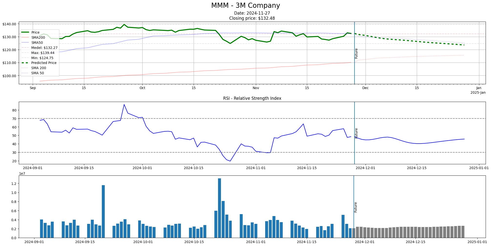

# Stock analysis

The purpose of the project is to provide insights into the stock market. The long term vision is to develop a web-based dashboard that highlights various buy and sell signals, combining predictions with technical analysis
to build a virtual portfolio with risk and value weigthed stocks.

# Datasets

The primary data source is the [S&P 500 Stocks dataset](https://www.kaggle.com/datasets/andrewmvd/sp-500-stocks) available on Kaggle, which is updated daily. The dataset contains 14 years of daily historical data.

| Date       | Symbol | Adj Close  | Close      | High       | Low        | Open       | Volume    |
| ---------- | ------ | ---------- | ---------- | ---------- | ---------- | ---------- | --------- |
| 2024-10-17 | ZTS    | 191.000000 | 191.000000 | 196.550003 | 190.889999 | 195.710007 | 1701200.0 |
| 2024-10-18 | ZTS    | 193.279999 | 193.279999 | 193.490005 | 190.500000 | 191.160004 | 1576400.0 |
| 2024-10-21 | ZTS    | 189.449997 | 189.449997 | 193.000000 | 189.179993 | 192.479996 | 959500.0  |
| 2024-10-22 | ZTS    | 189.509995 | 189.509995 | 189.820007 | 187.220001 | 188.410004 | 1441900.0 |
| 2024-10-23 | ZTS    | 188.990005 | 188.990005 | 189.979996 | 187.559998 | 189.399994 | 1339482.0 |

Two additional auxiliary datasets are used to provide detailed company information (not visualized here) and index pricing history.

| Date       | S&P500  |
| ---------- | ------- |
| 2024-10-16 | 5842.47 |
| 2024-10-17 | 5841.47 |
| 2024-10-18 | 5864.67 |
| 2024-10-21 | 5853.98 |
| 2024-10-22 | 5851.20 |

# Method

Prediction is carried out using the LSTM (Long Short-Term Memory) neural network model, which is a preferred method for time series forecasting. Due to the volatility of the stock market, the model needs to be retrained quite frequently.
Initially based on a single feature (Closing price) but eventually more features like volume and volatility. or other external data
that I can find that might strengthen the prognosis.

# Challenges

The main challenge is to interpret and define thresholds for all parameters involved in the process.
For example what constitutes a "buy signal"? How to combine technical analysis (which in nature is statistical)
with predictions based on machine learning and what conclusions could one draw from it?
It is also a challenge to collect datasets with aligning time series in a consistent manner.
In the long run, various API's and static downloads needs to be combined using adapters to produce intermediate
datasets that can be combined efficiently.

These challenges will be adressed during the implementation phase.

# Scope of project

The planned deliverable for the project scope is a program that allows the user to choose a particular stock
from the S&P 500 index and retreive an analysis of the historical data and future predictions.

# Installation

To install dependencies used by the Python scripts, run the command:

```bash
./install.sh
```

# Training

The training module fits a stock unique model to the latest available data.
Since data pre-processing is a quite compute intensive measure, the resulting data
files will be cached and available for reuse if re-training takes place. Using the
flag "fromcache" will try to load data locally. However, new data becomes available
every 24h; hence this flag should not be used in a production environment where the
latest source data is always prefered.

The generated models (and transforms) are outputted to the /models folder of the project.
For convenience, an image of the training statistics is also created in the same folder.
All files are named by its stock symbol name.

Note that GridSearch is used internally to choose the best learning rate and unit size.

If the script is run with the "interactive" flag, the statistics is also displayed after each succesful fit.
This is a blocking measure and should be avoided when the script is run in a batch fashion.

```bash
usage: train [-h] [--fromcache] [--list] [--interactive] [symbols ...]

positional arguments:
  symbols        Stock symbols to build

options:
  -h, --help     show this help message and exit
  --fromcache    Use pre-processed data (if available)
  --list         List all available symbols
  --interactive  Display stats as dashboard
```

## Example: Training models for the 3M and Microsoft stocks

```bash
python3 src/train.py MMM MSFT --interactive
```

Files generated on a fresh installation

```bash
models/
    MMM.keras  # Keras model
    MMM.save   # Transformer fitting params
    MMM.png    # Statistics
    MSFT.keras  # Keras model
    MSFT.save   # Transformer fitting params
    MSFT.png    # Statistics

# Pre-processed data cache files
data/
    sp500_companies.csv
    sp500_index.csv
    sp500_stocks.csv

# GridSearch cache files
tuning/
    MMM/*
    MSFT/*
```


## Example: Finding stock symbols

```bash
python3 src/train.py --list --fromcache
```

Output:

```
                              Shortname
Symbol
A            Agilent Technologies, Inc.
AAPL                         Apple Inc.
ABBV                        AbbVie Inc.
ABNB                       Airbnb, Inc.
ABT                 Abbott Laboratories
ACGL            Arch Capital Group Ltd.
ACN                       Accenture plc
ADBE                         Adobe Inc.
ADI                Analog Devices, Inc.
ADM      Archer-Daniels-Midland Company
ADP     Automatic Data Processing, Inc.
...
```

# Prediction

Stock price prediction using a trained model will generate a dashboard displaying 3 months of historical data
combined with 30 days of predicted future prices.

```bash
usage: predict.py [-h] [--fromcache] [--list] [symbols ...]

positional arguments:
  symbols      Stock symbols to predict

options:
  -h, --help   show this help message and exit
  --fromcache  Use pre-processed data (if available)
  --list       List all available symbols
```

## Example: Predicting stock price

```bash
python3 src/predict.py MMM
```


